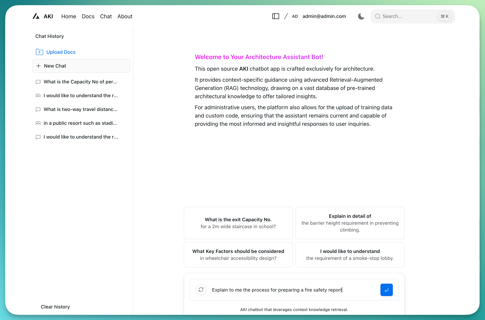

# LLM-RAG-Chat Chatbot

A web app featuring an AI-powered chatbot that leverages Retrieval-Augmented Generation (RAG) to provide accurate and contextual responses.
For the purpose of illustration of this project, an AKIChat is pre-trained to answer about architectural knowledge. Users can authenticate, store and share their chat history, while admins can expand the knowledge base through document uploads.

## Live Website

Visit the live website: [AKI Chat](https://akichat.vercel.app/)

## Features

- Interactive chat interface for querying (architectural information)
- User authentication using Next Auth for secure login and logout
- RAG-based responses using a combination of pre-trained language models and a curated knowledge base
- MongoDB integration for efficient storage and retrieval of document embeddings
- OpenAI's embedding process for semantic understanding of architectural texts
- Automatic extraction and embedding of knowledge from uploaded (architectural) documents
- User chat history storage and sharing functionality
- Redis integration for storing user information, session and chat data
- Admin panel for uploading additional documents to expand the knowledge base



## Tech Stack

### Frontend and Backend

- [Next.js 14](https://nextjs.org/docs/getting-started) - React framework for full-stack web applications
- [React](https://reactjs.org/) - A JavaScript library for building user interfaces
- [NextUI v2](https://nextui.org/) - Beautiful, fast and modern React UI library
- [Tailwind CSS](https://tailwindcss.com/) - A utility-first CSS framework
- [Tailwind Variants](https://tailwind-variants.org) - Tailwind CSS variants generator
- [TypeScript](https://www.typescriptlang.org/) - Typed superset of JavaScript
- [Framer Motion](https://www.framer.com/motion/) - Animation library for React
- [next-themes](https://github.com/pacocoursey/next-themes) - Perfect dark mode in Next.js

### Authentication

- [Next Auth](https://next-auth.js.org/) - Authentication for Next.js

### Database and Caching

- MongoDB - Document-oriented database for storing embeddings and document data
- Redis - In-memory data structure store for user information and session management

### AI/ML and Framework

- OpenAI API - For embeddings and language model
- LangChain - Language model integration framework

## Responsive Design

The application is built with a mobile-first approach, ensuring a seamless experience across all devices:

- **Desktop**: Full-featured interface with optimized layouts for larger screens.
- **Tablet**: Adaptive design that adjusts to medium-sized screens.
- **Mobile**: Streamlined Chat interface for easy navigation and interaction on smaller screens.

## Dark Mode

The application supports system-based dark mode:

- Switches between light and dark themes based on user's preferences.
- Consistent styling across all components in both light and dark modes.

## How It Works

1. **User Authentication**:

   - Users can sign up, log in, and log out securely using Next Auth.
   - Authentication state is managed across the application.

2. **Document Ingestion**:

   - Uploaded documents (PDFs, texts) are processed and relevant information is extracted.
   - The extracted text is divided into smaller chunks for efficient processing.

3. **Embedding Generation**:

   - Each text chunk is converted into a vector embedding using OpenAI's embedding model.
   - These embeddings capture the semantic meaning of the text.

4. **Database Storage**:

   - The embeddings, along with their corresponding text chunks, are stored in MongoDB.
   - This creates a searchable knowledge base of architectural information.

5. **User Query Processing**:

   - When a user submits a query, it is also converted into an embedding.
   - This query embedding is used to search the MongoDB for the most semantically similar text chunks.

6. **RAG-based Response Generation**:

   - The retrieved relevant text chunks are used as context for the language model.
   - The model generates a response that combines its pre-trained knowledge with the specific (architectural) information from the retrieved chunks.

7. **Response Delivery**:

   - The generated response is sent back to the user through the chat interface.

8. **Chat History Management**:

   - Authenticated users' chat histories are stored and can be retrieved for future reference.
   - Users can share their chat histories with others.

9. **User Data Storage**:

   - User information and session data are stored in Redis for fast access and management.

10. **Knowledge Base Expansion**:
    - Authenticated admins can upload additional documents through the admin interface.
    - New documents are processed, embedded, and added to the existing knowledge base.

## Setup and Installation

1. Clone the repository:

   ```
   git clone https://github.com/bfcxfm/LLM-RAG-Chat.git
   ```

2. Install dependencies:

   ```
   cd LLM-RAG-Chat
   npm install
   ```

3. Set up environment variables:

   - Copy the `.env.example` file to a new file named `.env.local`:
     ```
     cp .env.example .env.local
     ```
   - Open `.env.local` and fill in your actual values for each environment variable, including Next Auth configuration.

4. Ensure MongoDB and Redis are running and accessible.

5. Run the development server:

   ```
   npm run dev
   ```

6. Open [http://localhost:3000](http://localhost:3000) in your browser to see the application.

## License

This project is licensed under the MIT License - see the [LICENSE.md](LICENSE.md) file for details.
